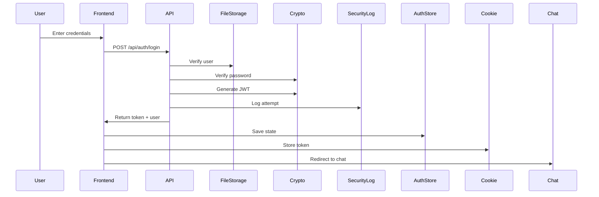

# 🚀 bolt.diy Multi-User System Documentation

**Developer: Keoma Wright**  
**Version: 1.0.0**  
**Date: 27 August 2025**

## 📋 Table of Contents
1. [Overview](#overview)
2. [Architecture](#architecture)
3. [Features](#features)
4. [Installation & Setup](#installation--setup)
5. [User Guide](#user-guide)
6. [Admin Guide](#admin-guide)
7. [Security](#security)
8. [API Reference](#api-reference)
9. [Technical Details](#technical-details)
10. [Troubleshooting](#troubleshooting)

## Overview

The bolt.diy Multi-User System transforms the single-user bolt.diy application into a comprehensive multi-user platform with isolated workspaces, personalized settings, and robust user management - all without requiring a traditional database.

### Key Highlights
- ✅ **No Database Required** - File-based storage system
- ✅ **Isolated Workspaces** - Each user has their own chat history and projects
- ✅ **Beautiful UI** - Stunning login/signup pages with glassmorphism design
- ✅ **Avatar Support** - Users can upload custom avatars
- ✅ **Admin Panel** - Comprehensive user management interface
- ✅ **Security** - JWT authentication with bcrypt password hashing
- ✅ **Personalized Experience** - Custom greetings and user preferences

## Architecture

### System Components

```
┌─────────────────────────────────────────────────┐
│                   Frontend                        │
├─────────────────────────────────────────────────┤
│  Authentication Pages  │  Protected Routes        │
│  - Login/Signup       │  - Chat Interface        │
│  - Avatar Upload      │  - User Management       │
│                       │  - Settings              │
├─────────────────────────────────────────────────┤
│                Authentication Layer               │
│  - JWT Tokens         │  - Session Management    │
│  - Auth Store         │  - Protected HOCs        │
├─────────────────────────────────────────────────┤
│                 Storage Layer                     │
│  File-Based Storage   │  User-Specific DBs       │
│  - .users/           │  - IndexedDB per user    │
│  - Security logs     │  - Isolated workspaces   │
└─────────────────────────────────────────────────┘
```

### File Structure

```
/root/bolt/
├── .users/                          # User data directory (secured)
│   ├── users.json                   # User registry
│   ├── security.log                 # Security audit logs
│   └── data/                        # User-specific data
│       └── {userId}/                # Individual user directories
├── app/
│   ├── components/
│   │   ├── auth/
│   │   │   ├── LoginForm.tsx
│   │   │   ├── SignupForm.tsx
│   │   │   └── ProtectedRoute.tsx
│   │   ├── chat/
│   │   │   ├── AuthenticatedChat.tsx
│   │   │   └── WelcomeMessage.tsx
│   │   ├── header/
│   │   │   └── UserMenu.tsx
│   │   └── admin/
│   │       └── UserManager.tsx
│   ├── lib/
│   │   ├── stores/
│   │   │   └── auth.ts
│   │   ├── utils/
│   │   │   ├── crypto.ts
│   │   │   └── fileUserStorage.ts
│   │   └── persistence/
│   │       └── userDb.ts
│   └── routes/
│       ├── auth.tsx
│       ├── admin.users.tsx
│       └── api.auth.*.ts
```

## Features

### 🔐 Authentication System

#### Login Page
- Beautiful gradient animated background
- Glassmorphism card design
- Remember me functionality (7-day sessions)
- Smooth tab transitions between login/signup
- Real-time validation feedback

#### Signup Page
- Avatar upload with preview
- Password strength indicator
- First name for personalization
- Username validation
- Animated form transitions

### 👤 User Management

#### User Profile
- Unique user ID generation
- Avatar storage as base64
- Preferences storage
- Last login tracking
- Creation date tracking

#### Admin Panel
- User grid with search
- User statistics dashboard
- Delete user with confirmation
- Edit user capabilities
- Activity monitoring

### 💬 Personalized Chat Experience

#### Welcome Message
- Personalized greeting: "{First Name}, What would you like to build today?"
- Time-based greetings (morning/afternoon/evening)
- User statistics display
- Example prompts

#### Chat History Isolation
- User-specific IndexedDB
- Isolated chat sessions
- Personal workspace files
- Settings per user

### 🎨 UI/UX Enhancements

#### Design Elements
- Glassmorphism effects
- Animated gradients
- Smooth transitions (Framer Motion)
- Dark/light theme support
- Responsive design

#### User Menu
- Avatar display
- Quick access to settings
- User management link
- Sign out option
- Member since date

## Installation & Setup

### Prerequisites
```bash
# Required packages
pnpm add bcryptjs jsonwebtoken
pnpm add -D @types/bcryptjs @types/jsonwebtoken
```

### Initial Setup

1. **Create user directory**
```bash
mkdir -p .users
chmod 700 .users
```

2. **Environment Variables**
```env
JWT_SECRET=your-secure-secret-key-here
```

3. **Start the application**
```bash
pnpm run dev
```

4. **Access the application**
Navigate to `http://localhost:5173/auth` to create your first account.

## User Guide

### Getting Started

1. **Create an Account**
   - Navigate to `/auth`
   - Click "Sign Up" tab
   - Upload an avatar (optional)
   - Enter your details
   - Create a strong password

2. **Login**
   - Enter username and password
   - Check "Remember me" for persistent sessions
   - Click "Sign In"

3. **Using the Chat**
   - Personalized greeting appears
   - Your chat history is private
   - Settings are saved per user

4. **Managing Your Profile**
   - Click your avatar in the header
   - Access settings
   - View member information

## Admin Guide

### User Management

1. **Access Admin Panel**
   - Click user menu → "Manage Users"
   - Or navigate to `/admin/users`

2. **View Users**
   - See all registered users
   - View statistics
   - Search and filter

3. **Delete Users**
   - Click trash icon
   - Confirm deletion
   - User data is permanently removed

4. **Monitor Activity**
   - Check security logs
   - View last login times
   - Track user creation

### Security Logs

Security events are logged to `.users/security.log`:
- Login attempts (successful/failed)
- User creation
- User deletion
- Errors

Example log entry:
```json
{
  "timestamp": "2024-12-27T10:30:45.123Z",
  "userId": "user_123456_abc",
  "username": "john_doe",
  "action": "login",
  "details": "Successful login",
  "ip": "192.168.1.1"
}
```

## Security

### Password Security
- **Bcrypt hashing** with salt rounds
- **Complexity requirements**:
  - Minimum 8 characters
  - At least one uppercase letter
  - At least one lowercase letter
  - At least one number

### Session Management
- **JWT tokens** with expiration
- **7-day session** option
- **Automatic logout** on expiration
- **Secure cookie storage**

### File Permissions
- `.users/` directory: `700` (owner only)
- User data files: JSON format
- Security logs: Append-only

### Best Practices
- Never store plain passwords
- Use environment variables for secrets
- Regular security log reviews
- Implement rate limiting (future)

## API Reference

### Authentication Endpoints

#### POST `/api/auth/login`
```typescript
Request: {
  username: string;
  password: string;
}

Response: {
  success: boolean;
  user?: UserProfile;
  token?: string;
  error?: string;
}
```

#### POST `/api/auth/signup`
```typescript
Request: {
  username: string;
  password: string;
  firstName: string;
  avatar?: string;
}

Response: {
  success: boolean;
  user?: UserProfile;
  token?: string;
  error?: string;
}
```

#### POST `/api/auth/logout`
```typescript
Headers: {
  Authorization: "Bearer {token}"
}

Response: {
  success: boolean;
}
```

#### POST `/api/auth/verify`
```typescript
Headers: {
  Authorization: "Bearer {token}"
}

Response: {
  success: boolean;
  user?: UserProfile;
}
```

### User Management Endpoints

#### GET `/api/users`
Get all users (requires authentication)

#### DELETE `/api/users/:id`
Delete a specific user (requires authentication)

## Technical Details

### Storage System

#### User Registry (`users.json`)
```json
{
  "users": [
    {
      "id": "user_123456_abc",
      "username": "john_doe",
      "firstName": "John",
      "passwordHash": "$2a$10$...",
      "avatar": "data:image/png;base64,...",
      "createdAt": "2024-12-27T10:00:00.000Z",
      "lastLogin": "2024-12-27T15:30:00.000Z",
      "preferences": {
        "theme": "dark",
        "deploySettings": {},
        "githubSettings": {},
        "workspaceConfig": {}
      }
    }
  ]
}
```

#### User-Specific IndexedDB
Each user has their own database: `boltHistory_{userId}`
- Chats store
- Snapshots store
- Settings store
- Workspaces store

### Authentication Flow



### Workspace Isolation

Each user's workspace is completely isolated:
1. **Chat History** - Stored in user-specific IndexedDB
2. **Settings** - LocalStorage with user prefix
3. **Files** - Virtual file system per user
4. **Deploy Settings** - User-specific configurations

## Troubleshooting

### Common Issues

#### Cannot Login
- Verify username/password
- Check security logs
- Ensure `.users/` directory exists

#### Session Expired
- Re-login required
- Use "Remember me" for longer sessions

#### User Data Not Loading
- Check browser IndexedDB
- Verify user ID in auth store
- Clear browser cache if needed

#### Avatar Not Displaying
- Check file size (max 2MB recommended)
- Verify base64 encoding
- Test with different image formats

### Debug Mode

Enable debug logging:
```javascript
// In browser console
localStorage.setItem('DEBUG', 'true');
```

View security logs:
```bash
tail -f .users/security.log
```

### Recovery

#### Reset User Password
Currently requires manual intervention:
1. Generate new hash using bcrypt
2. Update users.json
3. Restart application

#### Restore Deleted User
If backup exists:
1. Restore from users.json backup
2. Recreate user data directory
3. Restore IndexedDB if available

## Future Enhancements

### Planned Features
- [ ] Password reset via email
- [ ] Two-factor authentication
- [ ] User roles and permissions
- [ ] Team workspaces
- [ ] Usage analytics
- [ ] Export/import user data
- [ ] Social login integration
- [ ] Rate limiting
- [ ] Session management UI
- [ ] Audit trail viewer

### Performance Optimizations
- [ ] Database indexing strategies
- [ ] Lazy loading user data
- [ ] Caching layer
- [ ] CDN for avatars

## Contributing

This system was developed by **Keoma Wright** as an enhancement to the bolt.diy project.

### Development Guidelines
1. Maintain backward compatibility
2. Follow existing code patterns
3. Add tests for new features
4. Update documentation
5. Consider security implications

### Testing
```bash
# Run tests
pnpm test

# Type checking
pnpm typecheck

# Linting
pnpm lint
```

## License

This multi-user system is an extension of the bolt.diy project and follows the same license terms.

## Credits

**Developer**: Keoma Wright  
**Project**: bolt.diy Multi-User Edition  
**Year**: 2025

---

*This documentation provides a comprehensive guide to the bolt.diy Multi-User System. For questions or issues, please contact the developer or submit an issue to the repository.*