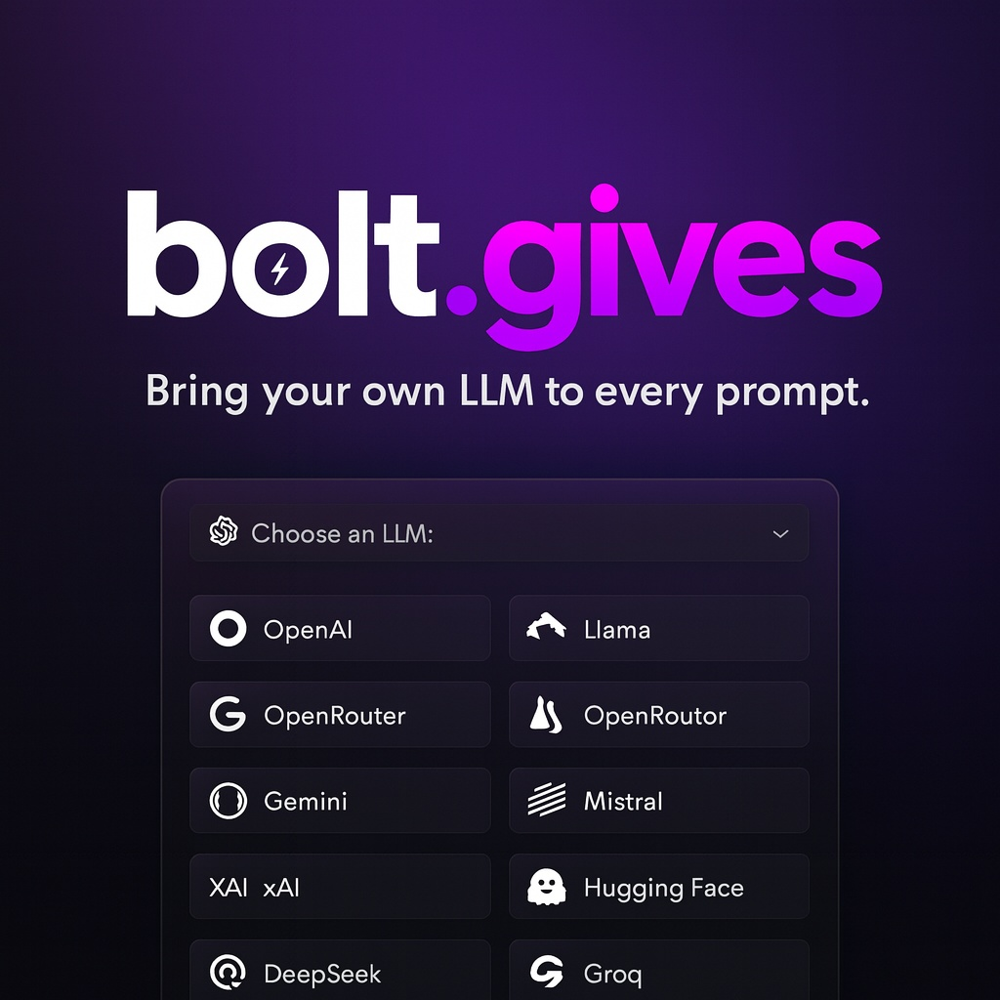

# Bolt.gives - Enhanced AI Development Platform



## 🚀 About This Fork

**Bolt.gives** is an advanced fork of bolt.diy that takes AI-powered development to the next level. While maintaining compatibility with the original, we're developing in a different direction focused on enterprise features, enhanced deployment capabilities, and multi-user collaboration.

### 🎯 Our Vision

We believe in making AI development accessible to everyone while providing professional-grade features for teams and enterprises. Bolt.gives is evolving beyond a simple development tool into a comprehensive platform for collaborative AI-assisted development.

## 🌟 Exclusive Features Not Available in bolt.diy

Our fork includes numerous advanced features that were submitted as PRs to bolt.diy but were not integrated into the main application:

### 🤖 **NEW: SmartAI - Detailed Conversational Coding (Bolt.gives Exclusive)**
- **Real-time explanations** of what the AI is doing and why
- **Educational feedback** that helps you learn as you code
- **Step-by-step narration** of the coding process
- **Best practices insights** shared during implementation
- **Debugging explanations** showing how issues are identified and fixed
- **Available for Claude Sonnet 4** with more models coming soon
- Transform "Generating Response..." into an interactive coding companion!

### ✨ **Comprehensive Save All System** 
- **One-click save** for all modified files
- **Auto-save functionality** with customizable intervals
- **Visual indicators** showing file modification status
- **Keyboard shortcuts** (Ctrl/Cmd+S) for quick saving
- **Smart file tracking** with modification timestamps
- Never lose your work again!

### 🚀 **Advanced Import Capabilities**
- **Import existing projects** from local folders
- **GitHub template integration** for quick starts
- **Automatic dependency detection**
- **File structure preservation**
- **Support for complex project hierarchies**
- Seamlessly migrate your existing projects

### 🔐 **Multi-User Authentication System**
- **User registration and login**
- **Workspace isolation** for security
- **Personalized settings** per user
- **File-based secure storage**
- **JWT authentication**
- **Optional guest mode** for quick access
- Perfect for teams and organizations

### 📦 **Quick Deploy to Netlify**
- **One-click Netlify deployment**
- **Automatic build configuration**
- **Environment variable management**
- **Site preview functionality**
- **Custom domain support**
- Deploy your projects in seconds

### 🤖 **Extended AI Model Support**
- **Claude 4 models** (Opus, Sonnet, Haiku)
- **Claude Sonnet 4 (SmartAI)** - Exclusive conversational coding variant
- **Auto-detection of Ollama** when configured
- **Enhanced provider management**
- **Automatic provider enablement** based on environment
- Access to the latest and most powerful AI models

### 🎨 **Enhanced UI/UX Features**
- **Project import from folders**
- **GitHub template integration**
- **Advanced model selector** with provider filtering
- **Improved error handling** and user feedback
- **Responsive design improvements**
- **Theme customization options**
- A more intuitive development experience

### 🔧 **Developer-Focused Improvements**
- **Better TypeScript support**
- **Enhanced debugging tools**
- **Improved console output**
- **Advanced file management**
- **Git integration enhancements**
- **Terminal improvements**
- Tools built by developers, for developers

## 💰 Coming Soon: Hosted Instances

We will be offering **Hosted Bolt.gives Instances** starting from **$5 per month** for a basic instance with the ability for donors to upgrade their resources. This will provide:
- Dedicated cloud environment
- No setup required
- Automatic updates
- Priority support
- Custom domain options
- Team collaboration features

## 🚀 Latest Updates from bolt.diy

We regularly merge the latest improvements from bolt.diy including:

### Recent Merged Features:
- **GitLab Integration** - Full GitLab support alongside GitHub
- **Branch Cloning Support** - Clone specific branches from repositories
- **Token Limit Fixes** - Improved handling of model token limits
- **Documentation Updates** - Enhanced help and documentation
- **UI Improvements** - Better header layout and help accessibility
- **Bug Fixes** - Various stability and performance improvements

## 📊 Feature Comparison

| Feature | bolt.diy | Bolt.gives |
|---------|----------|------------|
| Open Source | ✅ | ✅ |
| Free to Use | ✅ | ✅ |
| Claude 3.5 Support | ✅ | ✅ |
| Claude 4 Models | ❌ | ✅ |
| SmartAI Conversational Coding | ❌ | ✅ |
| Save All System | ❌ | ✅ |
| Import from Folder | ❌ | ✅ |
| Multi-User Auth | ❌ | ✅ |
| Quick Deploy to Netlify | ❌ | ✅ |
| Auto-detect Ollama | ❌ | ✅ |
| Hosted Instances | ❌ | Coming Soon |

## 📦 Installation

Bolt.gives maintains full compatibility with bolt.diy's installation process while adding additional features:

### Quick Installation

```bash
# Clone the repository
git clone https://github.com/embire2/bolt.gives.git
cd bolt.gives

# Install dependencies
pnpm install

# Set up environment variables
cp .env.example .env

# Start the development server
pnpm run dev
```

### Docker Installation

```bash
docker-compose up --build
```

### Environment Variables

Create a `.env` file with your API keys:

```env
# Core AI Providers
ANTHROPIC_API_KEY=your_anthropic_key
OPENAI_API_KEY=your_openai_key
GOOGLE_GENERATIVE_AI_API_KEY=your_google_key

# Optional Providers
GROQ_API_KEY=your_groq_key
OLLAMA_API_BASE_URL=http://localhost:11434
OPENROUTER_API_KEY=your_openrouter_key

# Deployment (Bolt.gives Exclusive)
NETLIFY_AUTH_TOKEN=your_netlify_token
GITHUB_TOKEN=your_github_token
```

## 🛠️ Development

### Available Scripts

- `pnpm run dev` - Start development server
- `pnpm run build` - Build for production
- `pnpm run start` - Start production server
- `pnpm run lint` - Run linting
- `pnpm run typecheck` - Check TypeScript types

## 🤝 Contributing

We welcome contributions! Our exclusive features are what make Bolt.gives special:

1. Fork the repository
2. Create your feature branch (`git checkout -b feature/AmazingFeature`)
3. Commit your changes (`git commit -m 'Add some AmazingFeature'`)
4. Push to the branch (`git push origin feature/AmazingFeature`)
5. Open a Pull Request

## 📜 License

This project is licensed under the MIT License - see the [LICENSE](LICENSE) file for details.

## 🙏 Acknowledgments

- Original [bolt.diy](https://github.com/stackblitz-labs/bolt.diy) team for the foundation
- All contributors who have submitted PRs and features
- The open-source community for continuous support and feedback

## 📞 Support

- **GitHub Issues**: [Report bugs or request features](https://github.com/embire2/bolt.gives/issues)
- **Community**: Join the discussion in our GitHub Discussions
- **Email**: support@bolt.gives (coming soon)

---

<div align="center">
  <strong>Built with ❤️ by the Bolt.gives Community</strong>
  <br>
  <em>Taking AI Development to the Next Level</em>
</div>